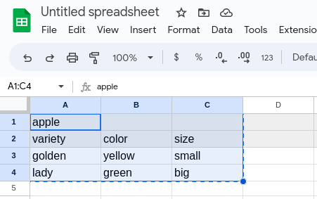
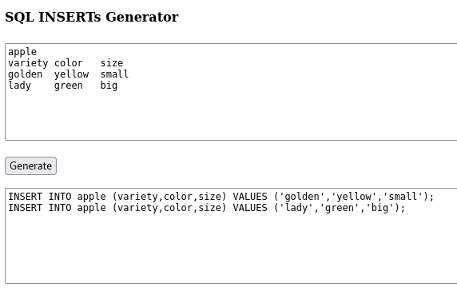

# SQL INSERTs Generator

The tool for generating SQL INSERT commands from a specified text.

Implemented in pure JavaScript, so no need to send your data to another parties. All data manipulations performs on your local machine (no internet connection required).

## Requirements

- Web browser
- Any tables or text editor (Google Spreadsheets, MS Excel, etc.)

## Getting started

### Prepare data in format

```
table1
column1 column2 columnN
valueA valueB valueC
valueD valueE valueF
```

For example:



### Paste all required cells to form and press the button.

The resulted SQL script will be in bottom area.



## Features

- For skipping quotation add `/nq` modifier to column name. This might be useful for numbers, etc.
- `NULL` values are automatically unquoted. 

## Alternatives

If you want for more powerful tool, see:

- [sqlizer](https://sqlizer.io/)
- [wtools](https://wtools.io/convert-excel-to-sql-queries)
- [beautifytools](https://beautifytools.com/excel-to-sql-converter.php)
- [konbert](https://konbert.com/convert/excel/to/sql)
